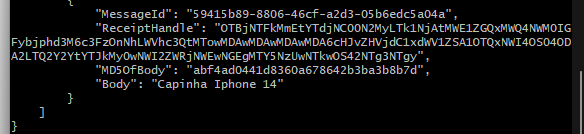

# project-localstack

Tecnologias utilizadas:
Python
boto3 (SDK)
localstack
dynamodb

Para rodar o projeto é necessário que execute o arquivo docker-compose.yml que está na pasta raiz do projeto.

# lambda-hello-world

1 - Criar lambda:

aws --endpoint-url=http://localhost:4566 \
lambda create-function --function-name func1 \
  --runtime python3.8 \
  --role arn:aws:iam::000000000000:role/lambda-role \
  --handler lambda_function.lambda_handler \
  --timeout 30 \
  --zip-file "fileb://lambda_function.zip" \
  --layers $LAYER_ARN

2 - Invoca uma função do Lambda

aws --endpoint-url=http://localhost:4566 lambda invoke --function-name func1 --cli-binary-format raw-in-base64-out --payload '{"first_name": "Ricardo", "last_name": "Yuri"}' response.json

3 - Será gerado um arquivo response.json com o Hello seguido dos dados que foram enviados na tag --payload.

4 -  {"message": "Hello Ricardo Yuri!"}

# Queue sqs

1 - Criar queue sqs (product-queue)

aws --endpoint-url=http://localhost:4566 sqs create-queue --queue-name product-queue

# product-producer

1 - Criar lambda:

aws --endpoint-url=http://localhost:4566 \
lambda create-function --function-name product-producer \
  --runtime python3.8 \
  --role arn:aws:iam::000000000000:role/lambda-role \
  --handler producer.send_message \
  --timeout 30 \
  --zip-file "fileb://producer.zip" \
  --layers $LAYER_ARN

2 - Invoca uma função do Lambda

aws --endpoint-url=http://localhost:4566 lambda invoke --function-name product-producer16 response2.json

3 - Verificar no queue sqs se foi inserido na fila a mensagem

aws --endpoint-url=http://localhost:4566 sqs receive-message --queue-url http://localhost:4566/000000000000/product-queue --max-number-of-messages 10 

4 - Resultado esperado:

# product-consumer

1 - Criar lambda:

aws --endpoint-url=http://localhost:4566 \
lambda create-function --function-name product-consumer22 \
  --runtime python3.8 \
  --role arn:aws:iam::000000000000:role/lambda-role \
  --handler consumer.receive_message \
  --timeout 30 \
  --zip-file "fileb://consumer.zip" \
  --layers $LAYER_ARN

2 - Invoca uma função do Lambda

aws --endpoint-url=http://localhost:4566 lambda invoke --function-name product-consumer22 response3.json

3 - Verificar arquivo response3.json na pasta raiz

4 - Resultado:

{"message": "Nome do produto que ser\u00e1 salvo na base noSql dynamoDB NOME PRODUTO UM"}
